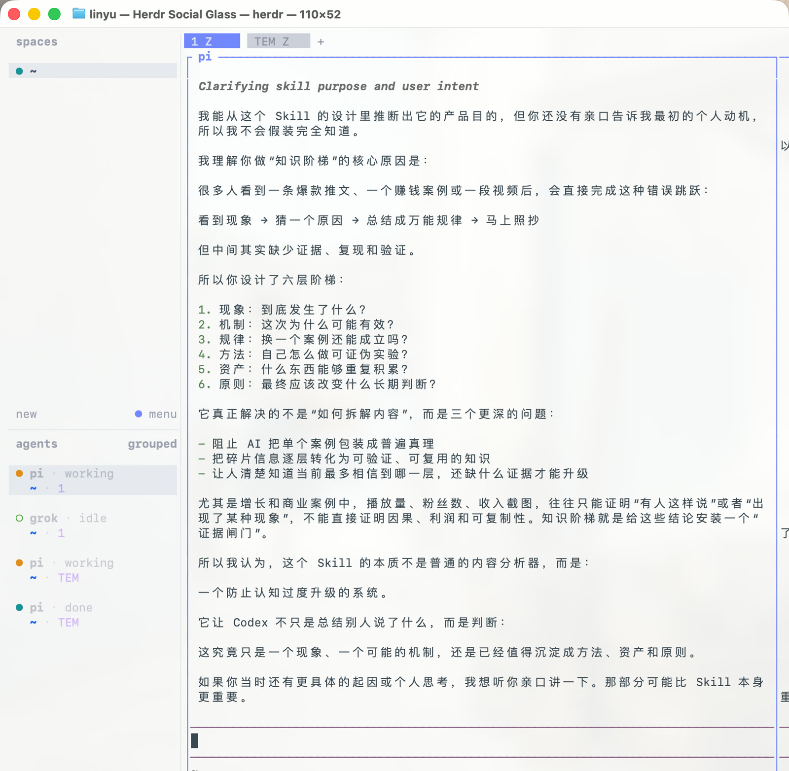
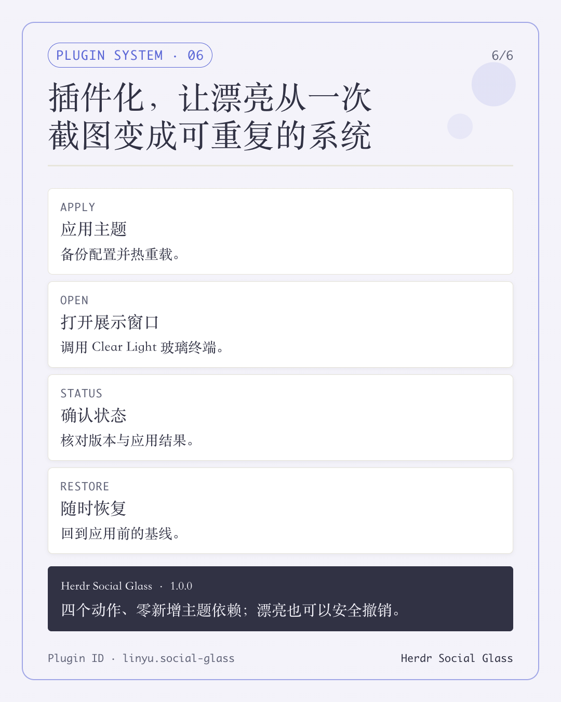

# Herdr Social Glass

Herdr Social Glass is a screenshot-friendly workspace preset for Herdr on macOS. It combines a translucent Terminal surface with an editorial Herdr layout, using only Herdr's built-in Catppuccin Latte theme and the existing macOS Terminal `Clear Light` profile.



## Design language

- **Soft transparency** — our visual language uses restrained blur and translucency to keep the desktop present without competing with the work.
- **Editorial structure** — a clear reading order, generous spacing, and deliberate pane proportions turn a terminal workspace into a composed canvas.
- **Hairline architecture** — fine pane borders and gaps provide structure without visual weight.
- **Lavender signal** — a focused accent color identifies active controls and agent state.
- **Visible collaboration** — pane titles, status lines, and the optional agent sidebar make roles and progress legible in screenshots.



## Requirements

- macOS
- Herdr 0.8.0 or newer
- macOS Terminal with the built-in `Clear Light` profile for the `open-window` action
- Bash and AppleScript, both included with macOS

## Install

Review the trust and configuration notes below, then install from GitHub:

```bash
herdr plugin install ythx-101/herdr-social-glass
```

## Actions

```bash
herdr plugin action invoke apply --plugin linyu.social-glass
herdr plugin action invoke open-window --plugin linyu.social-glass
herdr plugin action invoke status --plugin linyu.social-glass
herdr plugin action invoke restore --plugin linyu.social-glass
```

Open the guide inside Herdr:

```bash
herdr plugin pane open --plugin linyu.social-glass --entrypoint guide
```

### What each action does

- `apply` validates the bundled preset, backs up the current Herdr configuration when one exists, replaces the full configuration with the preset, and asks Herdr to reload it.
- `open-window` opens macOS Terminal with the `Clear Light` profile and starts Herdr in that window. It does not modify the Terminal profile.
- `status` reports the Herdr version and whether the active configuration exactly matches the bundled preset.
- `restore` backs up the current configuration, restores the saved pre-theme baseline, and asks Herdr to reload it.

## Trust, security, and configuration safety

A Herdr plugin can execute local commands. This plugin runs the readable shell scripts in [`scripts/`](scripts/) and uses AppleScript only to open and arrange a macOS Terminal window. Inspect the manifest and scripts before installing if you do not trust the source. The plugin has no third-party runtime or theme dependency and does not request network credentials.

The `apply` action intentionally replaces the **entire** Herdr configuration; it does not merge individual theme keys. Before replacement, it stores a timestamped copy of the current configuration in Herdr's local plugin-state area. The first apply that finds an existing configuration also records it as the restore baseline. Later applies keep that original baseline and add new timestamped backups. If no configuration exists, apply creates one without a baseline; `restore` remains unavailable until a baseline exists.

If Herdr rejects the new configuration during `apply`, the script restores the immediate backup (or removes the newly created configuration when none existed) and reloads again. The `restore` action copies the saved baseline back as the full active configuration after first backing up the current file. If that reload fails, the restored baseline remains on disk for inspection. Uninstalling the plugin does not itself restore the old configuration, so invoke `restore` first if you want to return to the baseline.

Backups are local copies of the full Herdr configuration and may therefore contain the same private values as that configuration. Protect and remove them according to your own local security policy.

## Local tests

From the repository root:

```bash
bash tests/smoke.sh
bash -n scripts/*.sh
git diff --check
```

The smoke test parses the manifest and theme, checks the plugin ID and minimum Herdr version, verifies all four actions are present, and checks the key Social Glass theme settings.

## Project files

- `herdr-plugin.toml` — plugin metadata, actions, and guide entry point
- `theme/social-glass.toml` — the complete Herdr preset
- `scripts/apply.sh` — validate, back up, apply, and reload
- `scripts/restore.sh` — restore the original baseline
- `scripts/open-social-window.sh` — open Terminal with the `Clear Light` profile
- `scripts/status.sh` — report whether the preset is active
- `scripts/guide.sh` — display this guide inside Herdr
- `tests/smoke.sh` — local manifest, syntax, and preset checks

## License

MIT. See [LICENSE](LICENSE).
