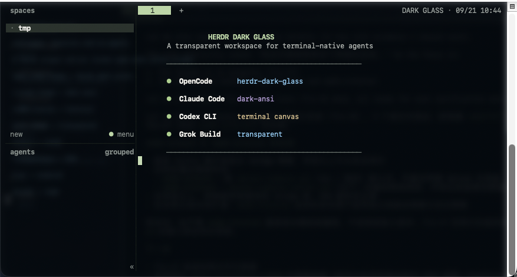

# Herdr Dark Glass

面向 macOS Terminal、Herdr 与终端 AI 工具的深色透明工作区。
A dark, transparent workspace for macOS Terminal, Herdr, and terminal-native AI tools.

## 效果呈现 / Preview

Terminal 提供 `#080E14` 深色底、54% 透明度与原生模糊；Herdr、OpenCode、Claude Code、Codex CLI 和 Grok Build 使用相互匹配的高对比度配色。
Terminal supplies the `#080E14` canvas, 54% transparency, and native blur while Herdr and supported CLIs provide matching high-contrast colors.



## 安装与使用 / Install & Use

### 环境 / Requirements

- macOS、Terminal，以及 Herdr 0.8.2 或更高版本。
- macOS, Terminal, and Herdr 0.8.2 or newer.
- OpenCode、Claude Code、Codex CLI 和 Grok Build 均为可选项。
- OpenCode, Claude Code, Codex CLI, and Grok Build are optional.

### 安装并启用 / Install and enable

安装插件 / Install the plugin:

```bash
herdr plugin install neverendingstory/herdr-dark-glass
```

首次使用按顺序执行 / Run these once, in order:

```bash
herdr plugin action invoke setup-dark-glass --plugin linyu.social-glass
herdr plugin action invoke apply-dark-glass --plugin linyu.social-glass
herdr plugin action invoke status --plugin linyu.social-glass
herdr plugin action invoke open-dark-glass-window --plugin linyu.social-glass
```

`setup-dark-glass` 会安装 OpenCode 主题资源；若缺少专用 Terminal profile，它会打开系统导入窗口，请明确确认导入后再运行 `status`。`open-dark-glass-window` 只在 profile 可用时启动窗口。

`setup-dark-glass` installs the OpenCode theme asset. If the dedicated Terminal profile is missing, it opens the visible system import dialog; confirm that import before running `status`. `open-dark-glass-window` launches only after the profile is available.

### CLI 配色 / CLI themes

在 Dark Glass 窗口中的对应 CLI 内完成一次选择；选择会持久保存。Make each selection once inside a Dark Glass window; selection persists globally.

| CLI | 设置 / Setting |
| --- | --- |
| OpenCode | `/themes` → `herdr-dark-glass`；再用 `Ctrl+P`：若显示 `Switch to dark mode` 则执行；已为深色时仅在显示 `Lock theme mode` 时执行后者 |
| Claude Code | `/theme` → `dark-ansi` |
| Codex CLI | 正常启动；背景由 Terminal 管理 / run normally; Terminal owns the canvas |
| Grok Build | `/theme transparent` |

### 日常启动 / Daily launch

将别名加入 `~/.zshrc` / Add this alias to `~/.zshrc`:

```zsh
alias herdrdg='herdr plugin action invoke open-dark-glass-window --plugin linyu.social-glass'
```

然后运行 / Then run:

```bash
source ~/.zshrc
herdrdg
```

`herdrdg` 以专用 profile 新建窗口并启动 Herdr，不会重复应用主题。`herdrdg` creates a window with the dedicated profile and starts Herdr; it does not reapply the theme. `apply-dark-glass` 会完整替换 Herdr 配置并可能移除自定义快捷键；`apply-dark-glass` replaces the complete Herdr configuration and can remove custom keybindings. 请先备份或合并个人配置，不要把 apply 命令放进日常别名。

需要回到首次应用前的配置时 / To restore the first pre-theme configuration:

```bash
herdr plugin action invoke restore --plugin linyu.social-glass
```

## 原项目与许可 / Credits & License

本项目基于 linyu 的 [Herdr Social Glass](https://github.com/ythx-101/herdr-social-glass) 完善而成。
This project refines and extends linyu's [Herdr Social Glass](https://github.com/ythx-101/herdr-social-glass).

采用 [MIT License](LICENSE)。Licensed under the [MIT License](LICENSE).
